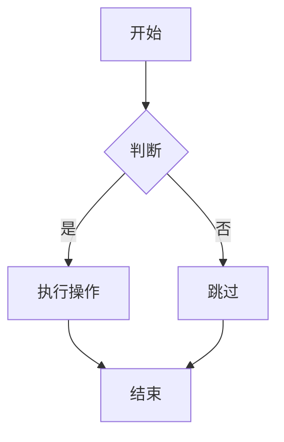
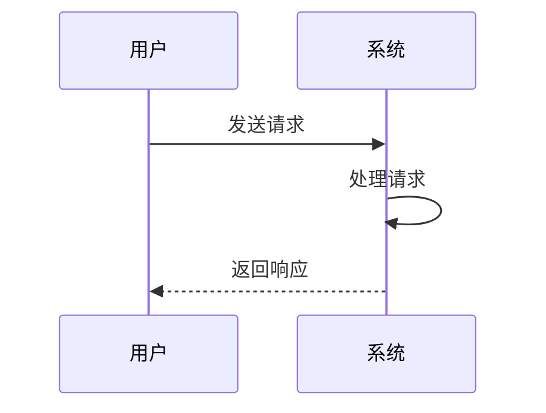
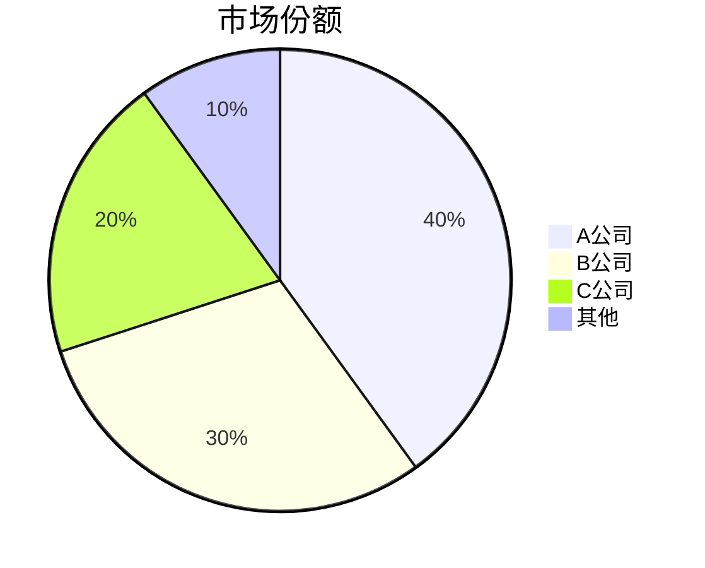

# PME 功能测试文档

本文档用于测试 PME 编辑器的所有功能特性。

---

## 一、标题测试

### 1.1 标题级别

# 一级标题

## 二级标题

### 三级标题

#### 四级标题

##### 五级标题

###### 六级标题

### 1.2 标题折叠

点击标题左侧的箭头可以折叠/展开下方内容。

# 可折叠的一级标题

这是折叠区域内的内容。

这是另一行内容。

## 二级标题（在折叠区域内）

二级标题的内容。

### 可折叠的三级标题

三级标题的内容。

#### 四级标题

四级标题的内容。

### 1.3 标题对齐

# 居中对齐标题

这是普通段落。

---

## 二、文本格式

### 2.1 基本格式

**粗体文本**

*斜体文本*

~~删除线文本~~

<u>下划线文本</u>

^上标文本^

~下标文本~

### 2.2 颜色与高亮

<span style="color: #dc2626">红色文本</span>

<span style="color: #2563eb">蓝色文本</span>

<span style="color: #16a34a">绿色文本</span>

<mark style="background-color: #fef08a; color: inherit;">黄色高亮</mark>

<mark style="background-color: #bfdbfe; color: inherit;">蓝色高亮</mark>

<mark style="background-color: #bbf7d0; color: inherit;">绿色高亮</mark>

### 2.3 代码

行内代码：`const x = 10;`

### 2.4 Emoji

😊 笑脸表情

🎉 庆祝表情

🔥 火焰表情

---

## 三、公式测试

### 3.1 行内公式

圆的面积公式：$S = \pi r^2$

勾股定理：$a^2 + b^2 = c^2$

希腊字母：$\alpha \beta \gamma \delta$

### 3.2 块级公式

$$
\int_{a}^{b} f(x) \, dx = F(b) - F(a)
$$

$$
\begin{pmatrix}
1 & 2 & 3 \\
4 & 5 & 6 \\
7 & 8 & 9
\end{pmatrix}
$$

$$
\sum_{i=1}^{n} i = \frac{n(n+1)}{2}
$$

### 3.3 命令测试

$\mathbf{粗体公式}$

$\mathbb{R}$ 实数集

$\sqrt{2}$ 平方根

---

## 四、代码块

### 4.1 JavaScript

```javascript
function greet(name) {
  console.log(`Hello, ${name}!`);
}

const arr = [1, 2, 3];
const doubled = arr.map(x => x * 2);
```

### 4.2 Python

```python
def fibonacci(n):
    if n <= 1:
        return n
    return fibonacci(n-1) + fibonacci(n-2)

for i in range(10):
    print(fibonacci(i))
```

### 4.3 Rust

```rust
fn main() {
    let s = String::from("Hello");
    println!("{}", s);
}
```

---

## 五、列表

### 5.1 无序列表

- 第一项
- 第二项

  - 嵌套项 A

  - 嵌套项 B

- 第三项

### 5.2 有序列表

1. 第一步

2. 第二步

3. 第三步

   1. 子步骤 A

   2. 子步骤 B

### 5.3 任务列表

- [x] 已完成任务
- [ ] 未完成任务
- [x] 另一个已完成任务

  - [ ] 嵌套未完成任务

  - [x] 嵌套已完成任务

---

## 六、引用

> 这是一段引用文本。

> 

> 引用可以有多行。

> 嵌套引用

> > 这是嵌套的引用内容。

---

## 七、表格

### 7.1 基本表格

| 姓名 | 年龄 | 城市 |
| ---- | ---- | ---- |
| 张三 | 25 | 北京 |
| 李四 | 30 | 上海 |
| 王五 | 28 | 广州 |

### 7.2 对齐方式

| 左对齐 | 居中对齐 | 右对齐 |
| :--- | :---: | ---: |
| 内容1 | 内容2 | 内容3 |
| 短 | 中等长度 | 较长的内容 |

---

## 八、链接与图片

### 8.1 链接

[百度](https://www.baidu.com)

[带标题的链接](https://github.com "GitHub")

### 8.2 图片


---

## 九、视频

<video src="https://www.w3schools.com/html/mov_bbb.mp4" data-asset-src="https://www.w3schools.com/html/mov_bbb.mp4" controls />

---

## 十、警告框（Callout）

<div class="callout callout--note" data-type="note" data-title="Note">这是普通提示信息，用于展示重要说明。</div>

<div class="callout callout--tip" data-type="tip" data-title="Tip">这是技巧提示，提供实用的操作建议。</div>

<div class="callout callout--important" data-type="important" data-title="Important">这是重要提示，需要特别注意的内容。</div>

<div class="callout callout--warning" data-type="warning" data-title="Warning">这是警告信息，可能存在风险。</div>

<div class="callout callout--caution" data-type="caution" data-title="Caution">这是小心提示，需要谨慎操作。</div>

---

## 十一、折叠详情块

<details>
<summary>点击展开详细内容</summary>
这是折叠块的详情内容。
可以包含多行文本。
### 甚至可以包含标题
以及其他格式。
</details>

---

## 十二、脚注

这是一段包含脚注的文本[^1]。

---

## 十三、目录

<div data-type="table-of-contents"></div>

---

## 十四、Mermaid 图表

### 14.1 流程图



### 14.2 时序图



### 14.3 饼图



---

## 十五、分割线

---

---

---

## 十六、搜索与替换测试

搜索关键词示例：测试、标题、公式

---

## 十七、源码模式测试

在源码模式下查看此文档的 Markdown 内容，验证所有格式的序列化正确性。

[^1]: 这是脚注的内容。
