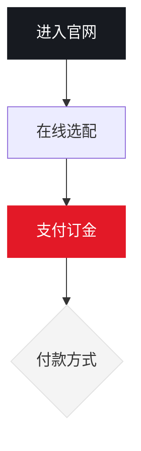

# 顽固问题分析与解决

## 问题概述

在编辑器中插入 Mermaid 图表后，图表在部分场景下显示异常，主要表现为：

- Mermaid 图表被压缩成很小的尺寸，无法正常阅读。
- 深色/浅色主题下，节点、连线、文字颜色不稳定，可能出现对比度不足或颜色未生效。
- 切换主题后，已经渲染出来的 Mermaid 图表不会同步更新主题样式。
- 打包后的 Tauri WebView 环境中，Mermaid SVG 的样式表现和开发环境不完全一致，导致问题更顽固。

## 多种理解与最终判断

针对这个问题，最初可能有几种理解：

1. Mermaid 本身渲染失败。
2. 编辑器节点宽度或缩放逻辑有问题。
3. 全局 CSS 影响了 Mermaid 生成的 SVG。
4. 主题切换只更新了应用 UI，没有重新处理 Mermaid 图表。

结合代码改动后，最终判断为：问题不是单一原因，而是 Mermaid SVG 与应用全局样式、主题初始化、WebView 渲染差异叠加造成的。

## 根因分析

### 1. 全局 SVG 样式泄漏到 Mermaid 图表

原来的设计系统样式直接使用了全局选择器：

```css
svg {
  width: 17px;
  height: 17px;
  stroke-width: 1.9;
}
```

这类规则本意是控制菜单、工具栏、按钮里的图标尺寸，但 Mermaid 渲染结果同样是 SVG，因此也被强制套用了 `17px` 的宽高。

结果是：Mermaid 图表虽然渲染成功，但最终视觉上被压缩成图标大小，看起来像是 Mermaid 没有正常工作。

### 2. Mermaid 主题变量没有跟随应用主题稳定初始化

Mermaid 默认主题与应用的浅色/深色主题不是同一套变量。即使应用已经切换主题，Mermaid 内部仍可能沿用旧配置或默认配置。

这会导致：

- 深色主题下节点背景、文字、连线颜色不协调。
- 浅色主题下部分元素仍保留深色或默认样式。
- 不同图表类型生成的 SVG class 和样式结构不同，表现不一致。

### 3. WebView 对 Mermaid SVG 内联样式的表现更敏感

在 Tauri 打包后的 WebView 中，Mermaid 生成的 SVG 样式、CSS 优先级、内联属性之间的覆盖关系可能和浏览器开发环境有差异。

如果只依赖 Mermaid 的 `themeVariables`，部分关键元素仍可能没有拿到正确颜色，所以需要在渲染后对 SVG 做一次兜底修正。

### 4. 主题切换后没有重新渲染已存在图表

主题切换只更新了应用整体主题，但已经生成到 DOM 里的 Mermaid SVG 不会自动重新计算 Mermaid 配置。

因此，旧图表会停留在切换前的颜色状态，直到重新打开或重新渲染文档。

## 解决办法

### 1. 限定图标 SVG 样式作用域

将原来的全局 `svg` 样式改为只作用于应用 UI 图标区域，例如：

- `.app-menu svg`
- `.toolbar svg`
- `.statusbar svg`
- `.icon-button svg`
- `.tab svg`
- `.tree-icon svg`
- `.recent-menu svg`

这样可以继续保持应用图标尺寸一致，同时避免污染 Mermaid 生成的 SVG。

同时为 Mermaid 图表补充专门规则：

```css
.ProseMirror .mermaid-diagram__content > svg {
  width: auto;
}
```

确保 Mermaid 图表不再被图标尺寸规则压缩。

### 2. 为 Mermaid 建立应用级主题变量

新增 `getMermaidThemeVariables()`，根据当前 `data-theme` 返回浅色或深色主题变量，统一配置：

- 背景色
- 节点填充色
- 节点边框色
- 连线颜色
- 文本颜色
- 字体族

然后通过 `initMermaidTheme()` 初始化 Mermaid：

```js
mermaid.initialize({
  startOnLoad: false,
  securityLevel: "strict",
  theme: "base",
  themeVariables: getMermaidThemeVariables(),
});
```

这样 Mermaid 的视觉风格与应用主题保持一致。

### 3. 渲染时注入 Mermaid init 配置

在每次渲染具体图表前，通过 `wrapMermaidCodeWithTheme(code)` 给 Mermaid 源码添加 `%%{init: ...}%%` 配置。

这一步可以降低 Mermaid 全局状态不一致带来的影响，让每个图表在渲染时都带上当前主题配置。

### 4. 渲染后增加 SVG 样式兜底

新增 `applyMermaidSvgThemeFallback(svg)`，在 Mermaid 输出 SVG 后，对关键元素补充属性和 `important` 样式：

- 节点形状：设置 `fill` 和 `stroke`
- 连线和关系线：设置 `stroke`
- 箭头 marker：设置 `fill` 和 `stroke`
- 文本和 `tspan`：设置 `fill`
- HTML label：设置 `color`

这一步解决的是 Mermaid 内部样式、外部 CSS、WebView 渲染差异之间的优先级问题。

### 5. 主题切换后重置并重绘 Mermaid

新增 `updateMermaidTheme()`：

1. 调用 `mermaid.reset()` 清理 Mermaid 内部配置。
2. 重新初始化当前主题变量。
3. 找到页面上已有的 `.mermaid-diagram__content`。
4. 使用节点保存的 `dataset.code` 重新渲染图表。

设置窗口切换主题时调用该函数，确保已有 Mermaid 图表即时刷新。

## 验证标准

这个问题的修复可以用以下标准判断是否成功：

- Mermaid 图表不再被压缩成 17px 图标大小。
- 浅色主题下节点、文字、连线清晰可读。
- 深色主题下节点、文字、连线清晰可读。
- 切换浅色/深色主题后，已有 Mermaid 图表会同步更新。
- Tauri 打包后的 WebView 中 Mermaid 显示和开发环境保持一致。
- 自动化测试确认全局 `svg` 样式不会继续泄漏到 Mermaid 图表。
- 自动化测试确认 Mermaid 渲染后存在关键颜色兜底逻辑。

## 涉及文件

- `src/editor/mermaid-node.mjs`
- `src/styles/editor.css`
- `src/styles/variables.css`
- `src/ui/settings-modal.mjs`
- `tests/design-system.test.mjs`
- `tests/mermaid-node.test.mjs`

## 结论

这是一个典型的顽固前端渲染问题：表面看是 Mermaid 图表显示异常，实际根因横跨全局 CSS 污染、第三方库主题状态、SVG 样式优先级和 Tauri WebView 环境差异。

最终解决思路是：

1. 收窄全局样式作用域，先阻断污染源。
2. 用应用主题变量显式控制 Mermaid。
3. 在单图渲染时注入主题配置，减少全局状态依赖。
4. 渲染后对 SVG 做关键样式兜底，增强 WebView 可靠性。
5. 主题切换时重置并重绘 Mermaid，保证状态同步。

该方案没有引入额外抽象，也没有扩大改动范围，重点是把 Mermaid 的尺寸、颜色和主题生命周期都纳入应用自身可控范围。

---

# Mermaid 复杂长图导出 PDF 空白页与跨页问题

## 问题现象

在编辑器中插入简单 Mermaid 图表时，例如只有上下两个方框，导出 PDF 基本正常。

但当 Mermaid 图表变复杂、变成长纵向图后，导出 PDF 会出现明显异常：

- PDF 前几页出现空白页。
- 图表不是正常紧跟正文出现，而是被推到后面的页面。
- 图表本身仍然过大，可能跨越三页甚至更多页面。
- 导出过程提示成功，但生成的 PDF 排版不可用。

这个问题的迷惑性在于：简单图正常，复杂图异常，所以它不像是 Mermaid 渲染失败，也不像是 PDF 导出完全不可用，而是特定尺寸下触发的分页和缩放问题。

## 根因分析

### 1. Mermaid 长图导出时只限制宽度，没有限制高度

PDF 导出前，程序会把编辑器中的 Mermaid SVG 转换成 PNG 图片，再把图片放入导出的 HTML 中交给浏览器打印成 PDF。

原来的尺寸计算只考虑最大宽度：

```js
const scale = Math.min(1, pageMaxWidth / svgWidth);
```

这可以解决宽图撑破页面的问题，但不能解决长图过高的问题。

例如一个 Mermaid 图真实尺寸是 `600 x 2400`，宽度并没有超过 `600px`，所以缩放比例会保持为 `1`，最终仍以 `2400px` 的高度进入 PDF。

结果是：图表高度远远超过一页 PDF 的可打印区域。

### 2. PDF 样式强制 Mermaid 整块避免分页

导出 PDF 的 CSS 中，Mermaid 容器曾经包含强制避分页规则：

```css
break-inside: avoid !important;
page-break-inside: avoid !important;
```

这类规则对短图是有帮助的，可以避免图表被拆开。

但对高度超过页面的长图来说，它会给 Chromium 的打印分页算法制造冲突：

1. 图表太高，一页放不下。
2. CSS 又要求图表内部不要分页。
3. 打印引擎尝试把整个图表挪到下一页。
4. 下一页仍然放不下。
5. 最终产生前置空白页，并且图表还是被迫跨页。

所以空白页不是导出失败，而是“超高元素 + 强制避分页”共同触发的打印分页异常。

### 3. 简单图正常掩盖了真实根因

简单 Mermaid 图高度较小，即使只按宽度缩放，也能放进一页。

因此简单图不会触发分页冲突，看起来导出逻辑是正确的。

只有图表纵向增长到超过页面高度后，隐藏的问题才暴露出来。

## 解决办法

### 1. Mermaid 导出尺寸同时限制宽度和高度

将导出尺寸计算改为同时接受最大宽度和最大高度：

```js
const scale = Math.min(1, maxWidth / sourceWidth, maxHeight / sourceHeight);
```

这样无论图表是横向过宽，还是纵向过高，都会按同一个比例缩小。

例如 `600 x 2400` 的长图，在最大宽度 `600px`、最大高度 `760px` 下，会被缩放为约 `190 x 760`，从而可以放入单页 PDF。

### 2. PNG 渲染和 SVG fallback 共用同一套尺寸规则

正常路径下，Mermaid SVG 会被转换成 PNG。

如果 PNG 转换失败，会回退为直接使用 SVG。

修复时确保这两条路径都使用同样的宽高约束，避免正常路径正确、fallback 路径又恢复成超大图。

### 3. 移除 PDF Mermaid 容器上的强制避分页规则

从 PDF 导出模板中移除 Mermaid 容器、viewport、content 上的强制规则：

```css
break-inside: avoid !important;
page-break-inside: avoid !important;
```

原因是图表已经在导出前被缩放到合理高度，不再需要用强制分页规则保护。

移除后，打印引擎不再被迫反复寻找“能完整放下超高图”的页面，从而避免前置空白页。

### 4. 保持 Mermaid 图表居中、无边框、不强制放大

导出样式继续保持：

- Mermaid 图表内容居中。
- viewport 不显示边框。
- SVG 使用 `width: auto`，不再被 `width: 100%` 强制撑满。
- PNG 图片使用计算后的像素宽度，并设置 `max-width: 100%`，只允许缩小，不允许无意义放大。

## 验证标准

修复后的行为应满足：

- 简单 Mermaid 图仍然正常导出。
- 复杂长 Mermaid 图不会在 PDF 前面制造空白页。
- 长图不会跨越三页显示。
- 图表会根据页面可用宽度和高度等比缩放。
- 图表在 PDF 中居中显示。
- 图表导出后没有外框。
- PNG 转换失败时，SVG fallback 仍然遵守相同的尺寸限制。

## 涉及文件

- `src/export/export-runtime.mjs`
- `src/core/pdf-export.mjs`
- `src/core/html-package.mjs`
- `tests/export-runtime.test.mjs`

## 结论

这个问题的本质不是 Mermaid 复杂图无法导出，而是导出阶段缺少“页面高度”这个约束。

之前的逻辑只知道“不要超过页面宽度”，却不知道“不要超过页面高度”。当图表变成长图后，PDF 打印引擎又受到强制避分页规则影响，于是出现空白页和跨页。

最终修复思路是：

1. 导出前按最大宽度和最大高度等比缩放 Mermaid 图。
2. PNG 和 SVG fallback 使用同一套尺寸计算。
3. PDF 中取消 Mermaid 容器的强制避分页规则。
4. 导出样式保持居中、无边框、只缩小不放大。

这次修复把问题从“依赖打印引擎自己处理超高图”改为“导出前主动生成适合 PDF 页面的图”，因此比单纯调整 CSS 更稳定。

---

# Mermaid 与思维导图编辑区宽度过宽、拖拽手柄无法使用问题

## 问题现象

在编辑器中插入 Mermaid 图表或思维导图后，出现两个容易反复修改失败的问题：

- Mermaid 图表和思维导图块宽度过宽，左右距离页面边距太近，看起来比普通正文内容区域更“顶格”。
- 选中 Mermaid 图表或思维导图后，左上角会出现块拖拽手柄；但鼠标从图表区域移向手柄时，手柄会立刻隐藏，导致无法拖住它来调整图表与其他段落的位置。

这两个问题表面上都发生在图表块上，但根因不同：一个是容器布局规则过度外扩，一个是拖拽手柄的显示生命周期没有覆盖“从块移动到手柄”的路径。

## 根因分析

### 1. 图表宽度过宽的根因：沿用了外扩式块布局

Mermaid 图表和思维导图的编辑器容器曾经使用类似下面的样式：

```css
width: calc(100% + 96px);
margin: 18px -48px;
```

这类写法会让块元素突破正文内容列，向左右各外扩 `48px`。它适合某些需要强调的宽内容，但对于 Mermaid 图表和思维导图来说，会造成两个问题：

- 图表边缘离编辑器页边距太近，视觉上比正文和普通块更拥挤。
- 图表内部如果还有滚动、缩放或交互区域，外扩容器会让边界判断更复杂，后续交互问题更难排查。

用户期望的是图表块与代码块/正文内容列保持一致的阅读宽度，而不是继续使用“宽屏展示”的外扩布局。

### 2. 拖拽手柄消失的根因：手柄显示依赖鼠标仍在当前块附近

块拖拽手柄来自 TipTap 的 `DragHandle` 扩展。这个扩展默认会根据鼠标所在的编辑器块来显示和定位手柄。

问题发生在下面这个移动路径中：

1. 鼠标移动到 Mermaid 图表或思维导图上。
2. TipTap 判断当前块可拖拽，于是在左上角显示拖拽手柄。
3. 用户想把鼠标移到手柄上开始拖拽。
4. 鼠标刚离开图表区域，扩展重新判断“鼠标不在当前块上”。
5. 手柄被隐藏，用户无法点击到它。

也就是说，手柄本身虽然显示出来了，但显示状态没有在“鼠标从块移动到手柄”期间被锁定。对普通段落来说，手柄离文本较近，不一定明显；但对 Mermaid 和思维导图这类大块、带内部交互区域的节点来说，这个缺陷会非常明显。

## 解决办法

### 1. 将图表容器收回正文内容列

把 Mermaid 图表和思维导图的容器样式改为普通内容宽度：

```css
width: 100%;
margin: 18px 0;
```

这样图表不再通过负边距向左右外扩，视觉宽度与正文区域保持一致，也减少了交互边界的复杂度。

### 2. 鼠标进入拖拽手柄时锁定手柄显示

TipTap 的 `DragHandle` 扩展本身提供了 `lockDragHandle` 和 `unlockDragHandle` 命令，因此不需要重写第三方库的鼠标定位逻辑。

修复方式是在创建拖拽手柄元素时补充：

```js
element.addEventListener("mouseenter", () => {
  options.getEditor?.()?.commands.lockDragHandle?.();
});

element.addEventListener("mouseleave", () => {
  options.getEditor?.()?.commands.unlockDragHandle?.();
});
```

这样鼠标从图表块移动到手柄上时，手柄会先被锁定，不会因为离开图表区域而立即隐藏。鼠标离开手柄后再解锁，恢复 TipTap 原本的行为。

## 验证标准

修复后的行为应满足：

- Mermaid 图表和思维导图不再贴近页面左右边距。
- 图表块宽度与正文内容列保持一致。
- 选中图表后，鼠标从图表移动到左上角拖拽手柄时，手柄不会消失。
- 可以通过拖拽手柄移动 Mermaid 图表和思维导图，与其他段落交换位置。
- 修复不影响普通段落、代码块、图片等其他块的拖拽行为。

## 涉及文件

- `src/styles/editor.css`
- `src/editor/editor-extensions.mjs`
- `src/app.mjs`
- `tests/design-system.test.mjs`
- `tests/drag-handle.test.mjs`

## 经验总结

这次问题的关键教训是：不要只看"图表本身"，还要区分图表外层容器、编辑器块选择、第三方拖拽扩展三套逻辑。

宽度问题属于 CSS 布局根因，不能靠调整图表内部 SVG 或画布尺寸解决；真正需要收敛的是外层块容器的 `width` 和 `margin`。

拖拽问题属于交互状态根因，不能靠扩大图表区域或强制显示手柄解决；真正需要补齐的是鼠标进入手柄时的状态锁定，让用户有机会完成"移向手柄并按下拖拽"的动作。

---

# 使用说明书在打包后无法加载的问题

## 问题现象

在开发环境中，通过"帮助-使用说明"菜单可以正常打开使用说明书文档。但打包成 exe 后，点击同样菜单会显示"使用说明书未找到"。

## 根因分析

### 1. 最初的方案：依赖运行时文件读取

最初的实现是前端调用 Rust 的 `read_readme_file` 命令，后端遍历多个路径查找说明书文件：

```rust
// 最初的搜索路径
let app_dir_candidates = [
    exe_dir.join("resources").join("assets"),
    exe_dir.join("assets"),
    exe_dir.to_path_buf(),
    // ...
];
```

问题在于：
- Tauri 打包后，前端资源文件被嵌入到 exe 内部，实际路径是 `resources/app/dist/assets/`
- Rust 代码没有覆盖这个路径，导致找不到文件

### 2. 中间方案：前端使用 asset 协议

尝试在前端使用 `fetch("asset:///assets/PME使用说明书.md")` 访问资源，但这种方式在某些 WebView 环境下可能不稳定。

### 3. 最终正确方案：Vite 静态导入

最终解决方案是使用 Vite 的 `?raw` 导入语法，在构建时将说明书内容直接嵌入到 JS 模块中：

```js
import helpManualMarkdown from "./assets/PME使用说明书.md?raw";
```

这样做的优势：
- Vite 在构建时读取文件内容，打包进 JS 中
- 运行时不需要访问外部文件系统
- 不存在路径问题，无论开发环境还是打包后都能正常工作

## 解决办法

### 使用 Vite 的 `?raw` 导入语法

将说明书文件作为原始文本导入：

```js
import helpManualMarkdown from "./assets/PME使用说明书.md?raw";
```

然后直接使用导入的变量：

```js
const markdown = helpManualMarkdown.trim()
  ? helpManualMarkdown
  : "# PME - Portable Markdown Editor\n\n使用说明书未找到。";
```

### 确保 Vite 正确处理 `.md` 文件

在 Vite 配置中确保 markdown 文件能被正确处理为静态资源。Vite 默认会将 `.md` 文件作为静态资源处理，加上 `?raw` 参数后会读取文件原始内容。

## 验证标准

- 开发环境中"帮助-使用说明"正常显示说明书
- 打包后的 exe 中"帮助-使用说明"正常显示说明书
- 无需依赖外部文件路径
- 无需额外的 Rust 后端逻辑

## 涉及文件

- `src/app.mjs`

## 经验总结

这个问题的关键教训是：**对于应用内嵌的静态资源（如帮助文档），优先使用构建时静态导入，而不是运行时文件读取。**

运行时文件读取的缺点：
- 需要处理复杂的路径问题（开发环境 vs 打包后路径不同）
- 需要额外的后端逻辑
- 容易因路径配置错误导致资源丢失

构建时静态导入的优点：
- 内容直接打包进 JS，不存在路径问题
- 运行时零依赖
- 更简单可靠

类似场景（如内嵌配置文件、模板文件、本地化文本）也应优先采用这种方式。

---

# Mermaid 自定义样式在调试版正常、正式版失效的问题

## 问题现象

Markdown 中的 Mermaid 图表包含合法的自定义样式：



使用 `npm run tauri dev` 启动时，节点填充色、边框色和文字颜色均正常；使用 `npm run tauri build` 生成的正式版却先后出现：

- 未设置自定义样式的节点变成黑底黑字。
- `style A`、`style C` 等指令部分或全部失效。
- 黑色节点中的白色文字变成深色，几乎无法辨认。
- 连线变成纯黑色或视觉上异常粗重。
- 某次修改只能恢复部分节点，其他节点仍然错误。
- 调试版始终正常，只有正式 exe 能稳定复现。

问题多次修改才最终解决。它不是单一的 Mermaid 语法或 CSS 优先级问题，而是“正式 WebView 的 SVG 样式执行差异”和“Mermaid 11 节点 DOM ID 规则变化”两个问题叠加。

## 根因分析

### 1. SVG 中存在 `<style>`，不等于正式 WebView 已应用其中样式

Mermaid 生成的 SVG 包含 `<style>`，默认节点、文字和连线颜色主要依赖这些内嵌 CSS。

Vite 调试页面通过 HTTP 服务加载，内嵌 SVG 样式正常；Tauri 正式版使用打包资源协议，并受到 WebView、CSP 和资源加载方式影响。正式版中出现了“`<style>` 标签存在，但部分规则没有可靠生效”的情况，缺少元素级 `fill`、`stroke`、`color` 的 SVG 元素便退回浏览器默认黑色。

曾经使用下面的逻辑跳过兜底：

```js
if (hasMermaidSvgEmbeddedStyles(svg)) {
  return;
}
```

该判断只能证明样式标签存在，不能证明计算样式正确，是正式版继续异常的第一层根因。

### 2. Mermaid 11 的节点 DOM ID 与旧版不同

为了绕过正式版 SVG 内嵌 CSS 差异，程序会解析 Markdown 中的 `style` 指令，并在 Mermaid 渲染后把颜色写入对应 SVG 节点。

早期修改按旧经验查找：

```text
flowchart-A-0
flowchart-C-0
```

后来虽然允许任意数字后缀，仍然缺少当前 Mermaid 渲染实例的 ID 前缀。通过正式运行时的一次性诊断，最终确认 Mermaid 11.16 的真实节点 ID 为：

```text
pme-mermaid-3-flowchart-A-0
pme-mermaid-3-flowchart-B-1
pme-mermaid-3-flowchart-C-3
```

完整结构是：

```text
当前 SVG ID + "-flowchart-" + Markdown 节点 ID + "-" + Mermaid 内部数字序号
```

旧选择器一直找不到真正的 `g.node`，所以后处理虽然执行了，显式颜色和白色文字却没有写入。这是多次修改无效的第二层根因。

### 3. Mermaid 标签同时存在 SVG 和 HTML 两种形式

Mermaid 标签可能是 SVG `<text>`、`<tspan>`，也可能是 `<foreignObject>` 中的 HTML `<div>`、`<span>`。

只修改 `fill` 无法覆盖 HTML 标签的 `color`。因此节点填充色即使正确，文字仍可能保持深色。修复必须同时处理 SVG 文字和 `foreignObject` 内的 HTML 文字。

### 4. 通用 `!important` 兜底会反过来破坏用户样式

最初曾对节点、文字和连线统一写入主题颜色并使用 `!important`。这样虽然能让默认图表暂时可见，却覆盖了用户声明的：

```mermaid
style A fill:#171A20,stroke:#171A20,color:#fff
```

这种修改只处理了黑色异常的表象。正确优先级必须是：

1. 固化默认主题颜色。
2. 不覆盖元素已有的显式属性或内联样式。
3. 最后重新应用 Markdown 中用户声明的 `style` 指令。

## 最终解决办法

### 1. 不再根据 `<style>` 是否存在决定是否执行兜底

Mermaid 渲染后，始终为缺少显式 `fill`、`stroke`、`color` 的关键元素补充默认主题值：

```js
function setMermaidSvgPaint(element, property, value) {
  if (element.hasAttribute(property) || element.style.getPropertyValue(property)) {
    return;
  }
  element.setAttribute(property, value);
  element.style.setProperty(property, value);
}
```

正式版不再依赖 Mermaid 内嵌 CSS 是否被 WebView 正确执行，同时保留 Mermaid 已写入元素的显式样式。

### 2. 规范化并解析 Mermaid `style` 指令

先把行首误写的 `Style` 规范化为 Mermaid 标准小写 `style`，再解析 `fill`、`stroke`、`stroke-width` 和 `color`。解析出的用户样式在默认兜底之后应用，保证用户声明优先。

### 3. 按 Mermaid 11 的真实 ID 精确定位节点

节点查找使用当前 SVG 的 `id` 构造前缀：

```text
${svg.id}-flowchart-${nodeId}-
```

并验证剩余部分是 Mermaid 生成的数字序号。同时保留：

- `data-id` 精确匹配。
- 节点自身 ID 精确匹配。
- 旧版 `flowchart-${nodeId}-${number}` 格式。
- 节点 class 精确分词匹配。

不能使用宽泛的 `id.includes(nodeId)`，否则短节点 ID 可能误匹配其他节点。

### 4. 同时处理 SVG 文字和 HTML 标签

显式 `color` 同时应用到：

```text
text
tspan
foreignObject
foreignObject 内所有 HTML 子元素
```

仅对确认存在跨环境继承问题的 `foreignObject` 文字颜色使用局部高优先级，避免重新覆盖整张图表。

### 5. 使用真实正式版完成验证

最终没有停留在单元测试和 `npm run build`，而是执行：

```powershell
npm run tauri build
```

直接运行 `src-tauri/target/release/pme.exe` 打开真实问题文档并截图检查，确认：

- `A` 节点为黑底白字。
- `C` 节点为红底白字。
- 普通节点为白底深色字。
- 浅色决策节点样式正常。
- 连线为正常灰色细线。
- 调试版与正式版视觉一致。

## 多次修改未解决的教训

### 第一次：强制写入主题颜色

结果：默认节点可见，但用户自定义颜色被覆盖。

教训：不能用全局 `!important` 掩盖样式来源问题。

### 第二次：发现 `<style>` 就跳过兜底

结果：调试版正常，正式版仍黑底黑字。

教训：DOM 中存在样式表，不代表正式 WebView 已成功应用。

### 第三次：解析 `style` 后按旧 ID 查找

结果：代码执行，但找不到 Mermaid 11 的实际节点。

教训：第三方组件升级后，不能凭旧版 DOM 结构写选择器。

### 第四次：允许旧 ID 使用任意数字后缀

结果：仍缺少本次 Mermaid 渲染 ID 前缀。

教训：定位问题必须先记录真实运行时 DOM，不能继续猜 ID。

### 最终：采集正式运行时证据

通过一次性诊断显示全部 `g.node` 的真实 ID，确认完整格式后再修改查找规则，并重新构建正式 exe 验证。

教训：连续两次以上修改仍无效时，应停止叠加补丁，回到根因调查，采集正式环境的实际 DOM、计算样式、资源地址和错误信息。

## 如何避免再次发生

### 1. 所有依赖 WebView 行为的功能必须同时验证 dev 和正式版

以下功能不能只测试 `npm run tauri dev`：

- SVG、Mermaid、KaTeX、Mind Elixir 等动态生成内容。
- 内联 `<style>`、`style` 属性、CSS 变量和颜色选择器。
- 网络图片、视频和远程 API。
- `asset:`、`http://asset.localhost`、Blob URL、Data URL。
- 本地文件、内置帮助文档和打包资源。
- 拖入文件、系统菜单、快捷键和原生文件对话框。
- PDF、HTML、Word 等导出流程。

涉及这些功能时，至少执行：

```powershell
npm run build
npm run tauri build
```

并直接运行最新的 `src-tauri/target/release/pme.exe` 验证真实场景。

### 2. 不把“单元测试通过”等同于“正式版正确”

单元测试不能完整模拟：

- Tauri 正式版 CSP。
- WebView2 对 SVG 内嵌样式的处理。
- Vite 开发服务器与打包资源协议差异。
- 正式版资源路径、文件权限和 capability。
- WebView 中最终的 `computedStyle`。

环境相关问题必须增加正式 exe 的最小复现步骤。

### 3. 第三方渲染组件先观察真实 DOM，再写选择器

升级 Mermaid、Mind Elixir、TipTap 等依赖后，应检查：

- 实际元素标签和嵌套层级。
- `id`、`class`、`data-*` 的真实值。
- 标签是 SVG 文字还是 `foreignObject` HTML。
- 样式来自元素属性、内联样式还是 `<style>`。
- 开发版与正式版的计算样式是否一致。

选择器应基于稳定标识，并保留必要的旧版本兼容。

### 4. 样式覆盖必须明确优先级

图表样式顺序应为：

```text
应用默认主题
→ 只补缺失的 SVG 属性
→ 保留 Mermaid 原生显式样式
→ 最后应用用户 style 指令
```

不要在通用兜底层批量使用 `!important`。

### 5. 回归测试锁定正式问题特征

Mermaid 回归测试至少覆盖：

- `Style` 可规范化为 `style`。
- `fill`、`stroke`、`color` 可解析。
- 默认样式兜底不会因存在 `<style>` 而跳过。
- 节点 ID 支持 `${svg.id}-flowchart-${nodeId}-${number}`。
- 旧版 ID 和 `data-id` 仍兼容。
- 显式样式在默认兜底之后应用。
- SVG 文字和 `foreignObject` 文字都能正确着色。
- PDF、HTML、Word 导出不会退化为 Mermaid 源代码或错误颜色。

### 6. dev 正常、exe 异常时的检查顺序

1. 检查正式包是否包含最新构建产物及生成时间。
2. 确认运行的是最新 `target/release/pme.exe`，不是旧安装目录中的 exe。
3. 检查 Tauri CSP 的 `img-src`、`media-src`、`connect-src`、`style-src`。
4. 检查资源 URL 在 dev HTTP 服务和正式 `asset:` 协议下是否都有效。
5. 检查本地资源是否进入 Vite `dist` 或 Tauri bundle。
6. 检查元素是否存在但计算样式未生效。
7. 检查第三方组件生成的 DOM ID、class 和嵌套结构是否变化。
8. 检查原生命令注册、capability、文件权限和路径限制。
9. 使用真实文档、真实操作和真实导出流程验证正式 exe。

## 涉及文件

- `src/editor/mermaid-node.mjs`
- `tests/mermaid-node.test.mjs`
- `src-tauri/tauri.conf.json`
- `.trae/rules/project.md`

## 最终经验

调试版正确会制造“代码已经正确”的错觉。对 Tauri 应用而言，Vite 调试页面和正式 WebView 是两个不同运行环境。涉及 CSP、资源协议、内联 SVG、网络资源、本地文件和原生命令时，必须把正式 exe 作为独立目标验证。

连续修改仍不生效时，不应继续提高 CSS 优先级或扩大选择器范围。应先取得正式环境的真实证据：实际 DOM ID、计算样式、资源 URL、控制台错误和正式构建时间。此次问题最终得以解决，关键不是继续增加补丁，而是停止猜测并确认了 Mermaid 11 的真实节点 ID。
